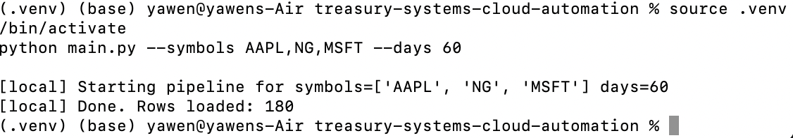

> **Why this project for National Grid (Treasury Systems):**
> - Python + SQL + Azure-ready pipeline shows cloud-first engineering.
> - Automation, anomaly detection, and alerting mirror optimization & controls.
> - Clean tests + CI reflect production hygiene and auditability.

# Treasury Systems – Cloud Automation Pipeline (Python + SQL + Azure-ready)

A compact data pipeline that:
1) **Ingests** synthetic time-series “market” data for symbols
2) **Transforms** it (returns, moving averages, anomaly flags)
3) **Loads** it into a SQL database (SQLite by default; switch to **Azure SQL** via `DATABASE_URL`)
4) **Alerts** (optional) to a webhook (Power Automate/Logic Apps) on errors

## What This Demonstrates
- Python data engineering (pandas, anomaly detection)
- SQL persistence (SQLite locally, Azure SQL ready)
- Cloud awareness (swap DB driver via env)
- Observability (webhook alerts)
- Dev hygiene (tests, CI, README, Dockerfile)

---

## Run Screenshot

